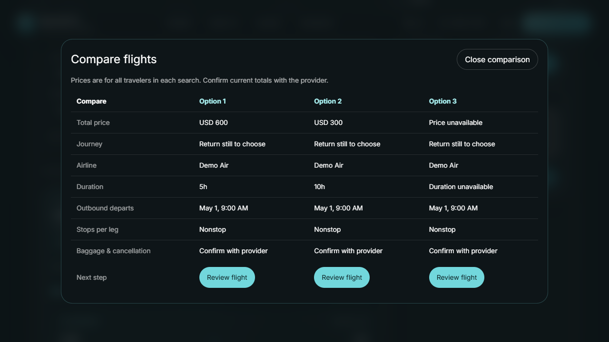
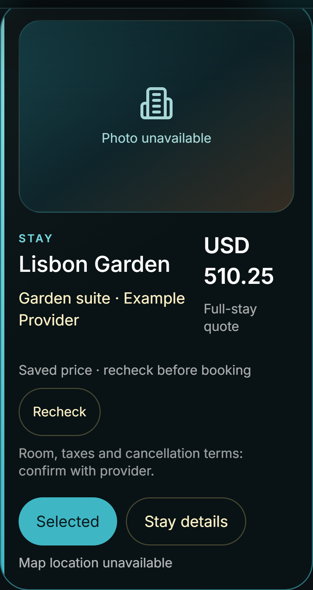
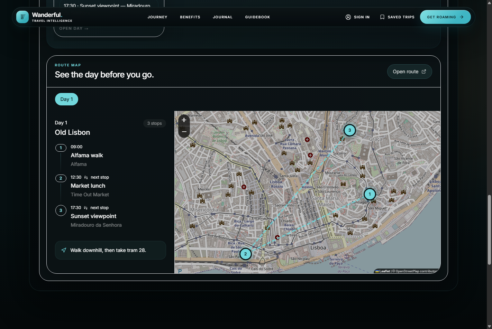
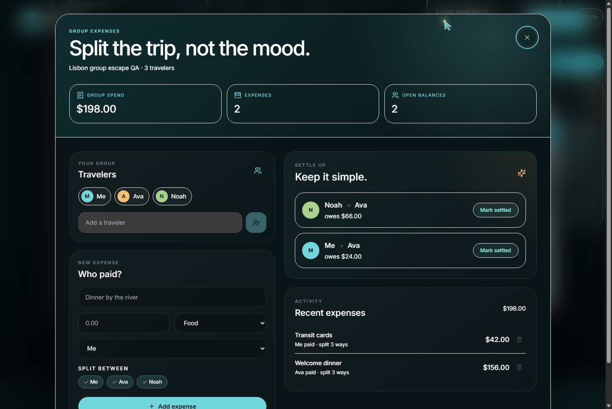
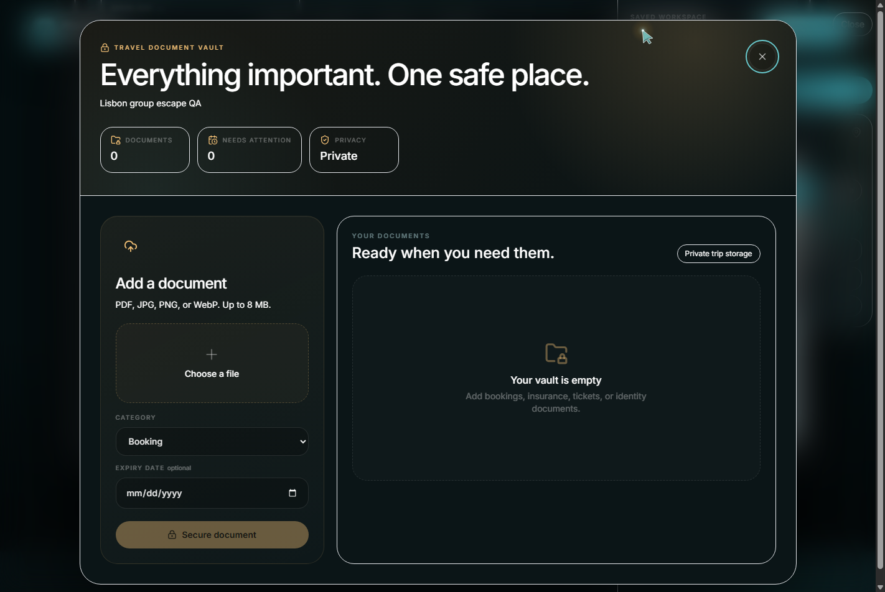
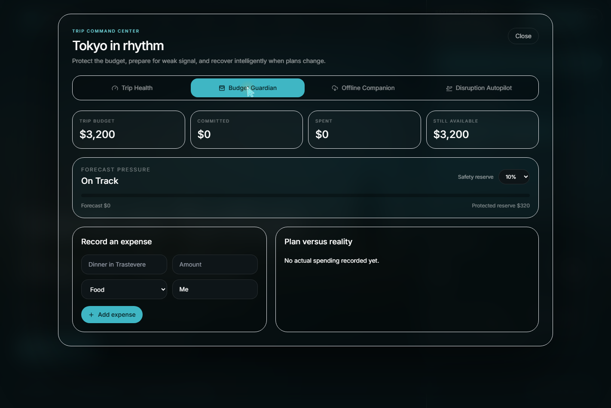
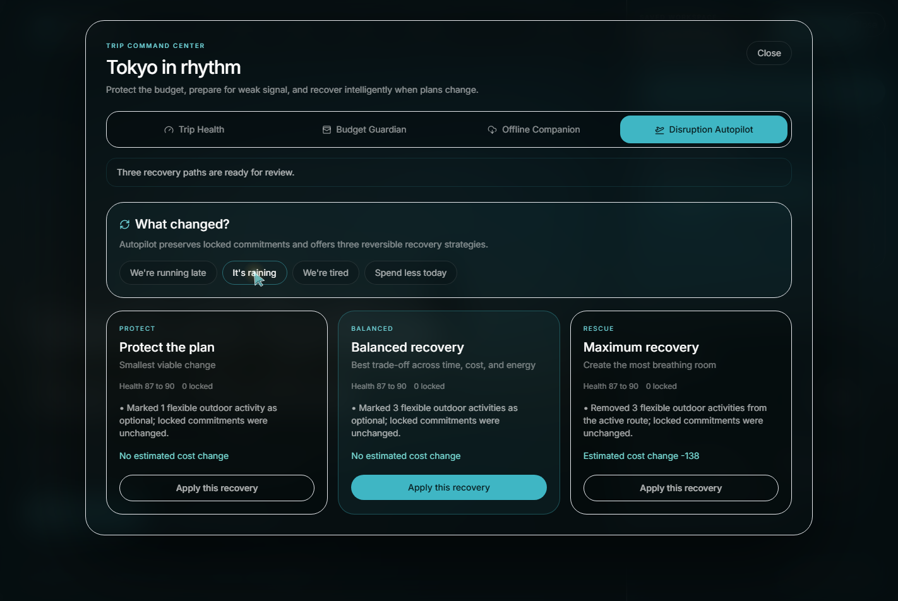

# Wanderful

**A travel workspace that plans with live context, protects what matters, and adapts when the trip changes.**

Wanderful turns a few trip details into a practical, day-by-day journey with live flight and hotel options, weather-aware activities, budget guidance, route maps, and tools for managing the trip after planning.

## Why Wanderful

Wanderful goes beyond generating a static itinerary. It gives travelers one place to plan, compare, coordinate, and respond to changes.

- **AI itinerary planning:** Build a paced day-by-day plan around dates, budget, interests, and traveler needs.
- **Flights and stays workspace:** Filter flights, compare up to three options, inspect hotel details and choose provider-supplied room rates. Selected quotes retain their identity and original price when results refresh.
- **Interactive route maps:** See each day's stops in order and understand how to move between them.
- **Trip Health:** Detect timing, weather, budget, evidence, and resilience risks before they become problems.
- **Budget Guardian:** Track exact-currency planned costs, commitments, linked payments, and a configurable reserve without double counting.
- **Disruption Autopilot:** Preview and apply safe itinerary repairs for rain, delays, fatigue, or budget pressure.
- **Offline Companion:** Prepare an account-scoped trip pack and reopen it read-only at `/offline`, including after an offline reload. Explicit logout removes device copies.
- **Plan history:** Restore earlier itinerary and selection revisions without undoing payments, settlements, or documents.
- **Weather monitoring:** Optional, disabled-by-default forecast checks with deduplicated in-app alerts and explicit recovery previews; no automatic itinerary changes.
- **Group expenses:** Split shared costs, track balances, and settle debts with a simple group workspace.
- **Travel document vault:** Keep tickets, bookings, insurance, and identity documents attached to the trip.
- **PDF export:** Download a concise itinerary for sharing or offline reference.
- **Personal travel memory:** Save trips, preferences, locks, and feedback to improve future plans.

## Product tour

### Compare flights and keep your chosen quote

The workspace separates Overview, Flights, Stays, Itinerary, and Trip tools. Flight
comparison supports up to three offers, with unknown prices and policies shown honestly.

Hotel property details expose available room rates. A selected rate is a saved quote,
not a reservation; booking happens with the external provider.

These two captures use automated test fixtures, not current bookable inventory.

### See the day before you go

The interactive route map connects itinerary stops with a clear sequence, timing, and travel guidance.

### Split the trip, not the mood

Add travelers and shared purchases, calculate balances automatically, and mark settlements as complete.

### Keep important documents with the trip

The private document vault organizes travel files by category and can flag upcoming expiry dates.

### Stay ahead of changing conditions

The trip command center combines budget monitoring, offline readiness, and disruption recovery.

<table>
  <tr>
    <td width="50%"></td>
    <td width="50%"></td>
  </tr>
  <tr>
    <td align="center"><strong>Budget Guardian</strong></td>
    <td align="center"><strong>Disruption Autopilot</strong></td>
  </tr>
</table>

## Technology

- React 18, TypeScript, TanStack Query, Vite, Tailwind CSS, Leaflet, and GSAP
- Flask API with secure cookie sessions, CSRF protection, rate limits, and structured logging
- CrewAI and LiteLLM orchestration with validated structured itineraries
- SQLAlchemy with SQLite locally and PostgreSQL/Neon in hosted environments
- Redis and RQ for production background planning jobs
- SerpAPI and OpenWeather provider integrations

## Project layout

The application lives in [`travel-planner/`](travel-planner/). See the [application README](travel-planner/README.md) for architecture, local setup, verification, database migrations, and production requirements.

Repository-level deployment and CI definitions live in [`render.yaml`](render.yaml) and [`.github/workflows/ci.yml`](.github/workflows/ci.yml).

## Status

The five-phase product upgrade is underway, not complete:

| Phase | Current state |
| --- | --- |
| 1. Trustworthy search and selection | Core local journeys verified; hosted schema activation remains separate |
| 2. Flights and stays experience | Comparison, filters, room-rate snapshots and flight-leg summaries implemented; automated accessibility and keyboard journeys covered |
| 3. Connected trip decisions | Preview/apply, overnight activity timing, exact accounting and ledger-backed legacy budget responses implemented |
| 4. Operational reliability | Individual records, offline reload/logout, explicit undo and persistent-vault configuration implemented; local regression gates documented below |
| 5. Provider evaluation and weather monitoring | Fixture/live-capped evaluation and opt-in weather queue implemented; live performance measurements outstanding |

Verification includes backend and desktop/mobile browser suites, production builds,
production offline reloads, disposable PostgreSQL migrations, and local volume persistence.
Latest local run (September 25, 2026): **116 backend tests and 34 frontend checks passed**;
the production build passed.
These are local fixture-based checks, not live-provider latency or availability guarantees.
See [implementation status](travel-planner/docs/IMPLEMENTATION_STATUS.md)
for evidence and remaining limitations.

Reopened trips use explicit Save to update the original saved trip with revision checking;
conflicts retain the local draft. Budget, constraints and disruption-apply routes now also
require a revision. Selection changes have a review step, and linked payments are counted
once. See [vault storage and migration](travel-planner/docs/VAULT_STORAGE.md) for local
volume configuration and safe file verification. Weather monitoring is implemented but
disabled by default; recovery always requires user action. See the [operations guide](travel-planner/docs/OPERATIONS.md).
Groups remain owner-managed, without invitations
or shared editing.

Wanderful is in controlled beta. New accounts require administrator approval before live planning is enabled. Provider prices and availability are time-sensitive and are not guarantees. Wanderful does not sell travel or process bookings; travelers should confirm booking terms, entry requirements, and final details with the relevant provider.

## Policies

See the [Security Policy](travel-planner/SECURITY.md), [Privacy Policy](travel-planner/PRIVACY.md), and [Terms of Use](travel-planner/TERMS.md).
